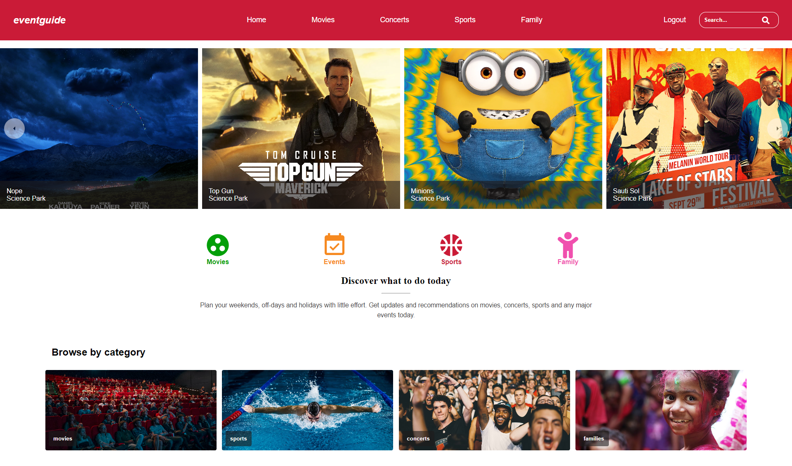

# Event Guide

## By Maurice Nganga

### _eventguide_ landing page

## Table of Content

- [Description](#description)
- [Features](#features)
- [Development](#development)
- [Live Link](#live-link)
- [Setup Instructions and Technology](#technology-used)
- [License](#license)

## Description

---

_eventguide_ is a web application meant to be help their clients in keeping upto date with major events that is meaningful to them. The user can browse and read any events when they land on the page, the can choose events by category, they can select an event interesting to them and read more about it. When they are in a particular event like movies they can read comments about that particular movie and also be able to comment on the movie. It allows them to delete the comment if they want to.

This is a _eventguide_ website with a front-end made using React and a backend made with Active records, Sinatra and Sqlite3. Active Record allowed us to create three models, _User_, _Product_ and _Review_ that could communicate with the tables, _users_, _products_ and _review_ in the Sqlite3 database with the help of migrations that we created. In each model if where we defined our Active Record associations for example:

> User has_many reviews and has_many products through reviews.

> Product has_many reviews and has_many users through reviews

> Review belongs_to user and also belongs_to product

Sinata helped in creating api endpoints that could be used by React frontend to get, post, delete and update the products and its associates. Through the use of routing methods that Sinatra provided like **get**, **post**, **patch** and **delete** Active Record and Sinatra also provided methods that could be used to initiate a new instance of the classes, _User_, _Product_ and _Review_ and be able to associate them.

The front-end is diployed in [vercel](https://vercel.com/) hosting service while the Sinatra is hosted in [heroku](https://heroku.com/).

## Features

---

A user visiting this page would be able to see:

1. A home page populated with events from different organizers.

2. A top navigation section with links to register or login for a new user and a link to post comment for a registed user.

3. A user can select an event by clicking on the cards and this will enable to read the full article in a single separate page

4. For a user they can visit the single event page and they are provided with tools to post, edit, and delete a comment in any event they are interested in.

5. A user can browse by category and can also search on a specific title in the given category they are in.

### Technology Used

---

- Used Visual Studio Code editor to create the front-end with _**React**_ and backend with _**Active Record**_, _**Sinatra**_, _**Sqlite3**_

- **Styled-components** - was used to create the structure and the styling of the website.

- **Context-Api** - was used to help persist a user across all pages in the website and enable them with accessibility privilages.

- **React** - help in creating interactive website

_**Active Record**_, _**Sinatra**_, _**Sqlite3**_ helped in creating the database, the three main models, _User_, _Product_, and _Review_ and their associations. Also in creating the tables _users_, _products_, and _reviews_ and and routing to be used in the frontend by clients for _get_, _post_,_patch_ and _delete_

---

## Development

---

Want to contribute? Excellent!

To enhance or contribute on the existing project, follow these steps:

- Fork the repo
- Create a new branch (git checkout -b enhance-feature)
- Make the appropriate changes in the files
- Add changes to reflect the changes made
- Commit your changes (git commit -m 'Enhanced feature')
- Push to the branch (git push origin enhance-feature)
- Create a Pull Request

### Live Link

---

\- Click this link to see the live website [eventguide](https://event-guide-jvquku5fg-moryno.vercel.app/)

## License

---

MIT License

Copyright (c) [2022] [Maurice Nganga]

Permission is hereby granted, free of charge, to any person obtaining a copy
of this software and associated documentation files (the "Software"), to deal
in the Software without restriction, including without limitation the rights
to use, copy, modify, merge, publish, distribute, sublicense, and/or sell
copies of the Software, and to permit persons to whom the Software is
furnished to do so, subject to the following conditions:

The above copyright notice and this permission notice shall be included in all
copies or substantial portions of the Software.

THE SOFTWARE IS PROVIDED "AS IS", WITHOUT WARRANTY OF ANY KIND, EXPRESS OR
IMPLIED, INCLUDING BUT NOT LIMITED TO THE WARRANTIES OF MERCHANTABILITY,
FITNESS FOR A PARTICULAR PURPOSE AND NONINFRINGEMENT. IN NO EVENT SHALL THE
AUTHORS OR COPYRIGHT HOLDERS BE LIABLE FOR ANY CLAIM, DAMAGES OR OTHER
LIABILITY, WHETHER IN AN ACTION OF CONTRACT, TORT OR OTHERWISE, ARISING FROM,
OUT OF OR IN CONNECTION WITH THE SOFTWARE OR THE USE OR OTHER DEALINGS IN THE
SOFTWARE.
